# BUSINESS DESIGN (BD) – HỆ THỐNG QUẢN LÝ TRUNG TÂM HÙNG CƯỜNG

> **Phiên bản:** 1.0  
> **Ngày lập:** 04/09/2026  
> **Nguồn nghiệp vụ chính:** `TrungTam_HungCuong_T8(2).xlsx`  
> **Frontend:** Angular  
> **Backend Platform:** Supabase (PostgreSQL + Auth + Data API + Storage + Realtime)  
> **Backend Logic:** Supabase Edge Functions (TypeScript/Deno)  
> **Frontend Hosting:** GitHub Pages (MVP/khẩn cấp)  
> **Mục tiêu:** Chuyển hệ thống quản lý trung tâm từ Excel sang Web App, giữ đủ nghiệp vụ hiện tại nhưng chuẩn hóa dữ liệu, phân quyền, tính toán và audit.

---

## 0. Tóm tắt điều hành

File Excel nguồn đang vận hành như một ERP mini cho trung tâm: quản lý lớp, học sinh, lịch học, điểm danh, học phí, công nợ, chuyển tháng, thu/chi, nhân sự, phân công, lương, quỹ và lợi nhuận. Workbook có **41 sheet**.

Hệ thống Web mới **không mô phỏng 1 sheet = 1 màn hình hoặc 1 bảng DB**. Dữ liệu được chuẩn hóa thành các entity độc lập như `students`, `classes`, `enrollments`, `class_sessions`, `attendance`, `tuition_ledgers`, `payments`, `staff`, `class_assignments`, `payroll_runs`...

### 0.1 Snapshot tháng 08/2026

- 4 lớp đang hoạt động: L06, L07, L08, L09.
- 50 học sinh xuất hiện trong roster/điểm danh.
- 48 học sinh xuất hiện trong sổ kế toán.
- 5 nhân sự có mã: 2 giáo viên + 3 trợ giảng.
- Tổng phải thu: **14.485.000 đ**.
- Đã thu học phí: **14.485.000 đ**.
- Công nợ tổng hợp: **0 đ**.
- Lương giảng viên theo workbook: **5.794.000 đ**.
- Chi phí khác: **6.270.898 đ**.
- Lợi nhuận trước quỹ: **2.420.102 đ**.
- Trích quỹ: **10% ≈ 242.010 đ**.
- Lợi nhuận được chia: **≈ 2.178.092 đ**.
- Workbook có `#REF!` tại `CHUYEN_THANG`; migration phải validate trước khi import.

---

# 1. Phân tích và trích xuất Excel

## 1.1 Lớp đang hoạt động

| Mã lớp | Tên lớp | Khối | Môn | Học phí/buổi | Lịch tuần | Cách thu | Buổi T8 | Roster | Kế toán | GV chính | Trợ giảng |
| --- | --- | --- | --- | --- | --- | --- | --- | --- | --- | --- | --- |
| L06 | Lớp 6 Thầy Cường | 6 | Toán | 50.000 đ | T5, CN | Theo buổi | 9 | 18 | 18 | Nguyễn Mạnh Cường | Nguyễn Hà Anh |
| L07 | Toán 7 Thầy Cường | 7 | Toán | 50.000 đ | T3, T6 | Theo buổi | 8 | 13 | 13 | Nguyễn Mạnh Cường | Đào Quang Duy |
| L08 | Toán 8 Thầy Cường | 8 | Toán | 50.000 đ | T3, CN | Theo buổi | 9 | 7 | 7 | Nguyễn Mạnh Cường | Đào Phương Anh |
| L09 | Toán 9 Thầy Cường | 9 | Toán | 60.000 đ | T2, T5 | Thu trước | 9 | 12 | 10 | Nguyễn Mạnh Cường | Đào Phương Anh |

### Nhận xét dữ liệu
1. L06, L07, L08 thu theo buổi; L09 thu trước.
2. L06/L07/L08: 50.000 đ/buổi; L09: 60.000 đ/buổi.
3. L09 có 12 HS trong roster điểm danh nhưng chỉ 10 HS trong sổ kế toán.
4. Có HS có đơn giá cá nhân khác mức chuẩn lớp, nên DB cần `unit_price_override`.

## 1.2 Nhân sự

| Mã | Họ tên | SĐT | Môn | Trạng thái | Ghi chú |
| --- | --- | --- | --- | --- | --- |
| GV001 | Nguyễn Mạnh Cường | - | Toán | Đang dạy | Dạy Toán 6, 7, 8, 9 |
| GV002 | Nguyễn Thị Huệ | - | Toán | Đang dạy | - |
| TG001 | Đào Quang Duy | 0394475010 | Toán | Đang dạy | Trợ giảng Toán 7 |
| TG002 | Đào Phương Anh | - | Toán | Đang dạy | Trợ giảng Toán 8, 9 |
| TG003 | Nguyễn Hà Anh | - | Toán | Đang dạy | Trợ giảng Toán 6 |

## 1.3 Mapping workbook → module Web

| Sheet/nhóm | Ý nghĩa | Entity/module mới |
| --- | --- | --- |
| DIEU_KHIEN | Thiết lập tháng, quỹ, tỷ lệ chia/lương | settings, accounting_periods |
| DANH_MUC_LOP | Danh mục lớp, học phí, lịch tuần, giáo viên | classes, class_schedules, class_assignments |
| LOP_01 → LOP_12 | Roster, lịch tháng, điểm danh C/N/P, nhận xét | students, enrollments, class_sessions, attendance, evaluations |
| KT_01 → KT_12 | Học phí từng học sinh, giảm trừ, thu, nợ | tuition_ledgers, payments, tuition_adjustments |
| DANH_SACH_LOP | Danh sách slot lớp | classes |
| GIANG_VIEN | Thông tin GV/TG | staff |
| PHAN_CONG | Phân công GV theo lớp/tháng | class_assignments |
| LUONG_GIANG_VIEN | Doanh thu lớp, tỷ lệ, thưởng/phạt, thực nhận | payroll_runs, payroll_items |
| THU_CHI | Thu/chi ngoài học phí | financial_transactions |
| THUONG_HOC_SINH | Thưởng học sinh | student_rewards |
| CHUYEN_THANG | Giảm trừ chuyển tháng | tuition_adjustments |
| TONG_HOP_LOP | KPI theo lớp | reporting view / RPC |
| QUY_CHIA | Quỹ dự phòng và chia lợi nhuận | fund_ledger, profit_distributions |
| TONG_QUAN | Dashboard tổng quan | dashboard Edge Function / reporting views |
| *_KIEM_TRA | Kiểm tra liên kết file Excel | data_integrity_checks / audit logs |
| *_HUONG_DAN | Hướng dẫn sử dụng Excel | Help/Documentation UI |

## 1.4 Data Quality

### DQ-01 – Roster và kế toán không đồng nhất
- Roster: 50 HS.
- Ledger: 48 HS.
- L09 thiếu ledger cho 2 HS đang xuất hiện ở roster.

**Thiết kế:** `enrollments` là nguồn roster chính; ledger được sinh từ enrollment, không duy trì roster kế toán riêng.

### DQ-02 – `#REF!` tại CHUYEN_THANG
Không carry-over bằng copy/paste/công thức ô. Dùng `tuition_adjustments` có FK tới student, period, ledger.

### DQ-03 – Thu/chi thiếu metadata
Có hai khoản chi có tiền nhưng chưa đủ ngày/nhóm/nội dung.

**Thiết kế:** transaction mới bắt buộc ngày, type, category, description, amount.

### DQ-04 – Lương có default 50% nhưng payroll đang áp dụng 40%
Tách `payroll_policy` khỏi kết quả payroll. Mỗi payroll item lưu snapshot rule.

### DQ-05 – Định dạng Excel không ổn định
Một số số buổi bị parse thành date do cell formatting.

**Thiết kế:** `planned_session_count` là integer; lịch thực dùng `class_sessions`.

---

# 2. Mục tiêu hệ thống

1. Quản lý trung tâm trên một Web App.
2. Loại bỏ liên kết công thức giữa nhiều file Excel.
3. Quản lý lớp, học sinh, GV/TG, lịch.
4. Điểm danh từng buổi.
5. Theo dõi BTVN, mức hiểu bài, thái độ, lỗ hổng và nhận xét.
6. Tự động tính học phí/công nợ.
7. Ghi nhận payment/adjustment/carry-over.
8. Tính lương.
9. Quản lý thu/chi, thưởng HS, quỹ, lợi nhuận.
10. Dashboard/báo cáo.
11. RLS/phân quyền/audit.
12. Import Excel cũ.

## 2.1 Ngoài MVP
- Parent portal.
- Zalo/SMS/Email tự động.
- Thanh toán online.
- Mobile app.
- AI sinh nhận xét.
- LMS/bài tập online.
- CRM tuyển sinh đầy đủ.

---

# 3. Actor và phân quyền

## ACT-01 ADMIN / OWNER
Toàn quyền: CRUD, phân công, finance, payroll, close period, settings, audit.

## ACT-02 ACCOUNTANT
Học phí, payment, công nợ, thu/chi, payroll preview, báo cáo tài chính.

## ACT-03 TEACHER
Xem lớp được phân công, lịch, roster, điểm danh, đánh giá.

## ACT-04 TEACHING ASSISTANT
Xem lớp được phân công, điểm danh, đánh giá theo quyền; không finance.

| Chức năng | Admin | Kế toán | GV | TG |
|---|:---:|:---:|:---:|:---:|
| Dashboard quản trị | ✅ | ✅ | Giới hạn | Giới hạn |
| Quản lý lớp | ✅ | Xem | Lớp mình | Lớp mình |
| Quản lý học sinh | ✅ | Xem | Lớp mình | Lớp mình |
| Điểm danh | ✅ | ❌ | ✅ | ✅ |
| Đánh giá học tập | ✅ | ❌ | ✅ | ✅ |
| Nhân sự/Phân công | ✅ | Xem | Xem | Xem |
| Học phí/Payment | ✅ | ✅ | ❌ | ❌ |
| Thu/chi | ✅ | ✅ | ❌ | ❌ |
| Payroll | ✅ | ✅/Preview | Tùy cấu hình | Tùy cấu hình |
| Đóng tháng | ✅ | Preview | ❌ | ❌ |
| Settings/Audit | ✅ | ❌ | ❌ | ❌ |

---

# 4. Kiến trúc dự án

## 4.1 Architecture

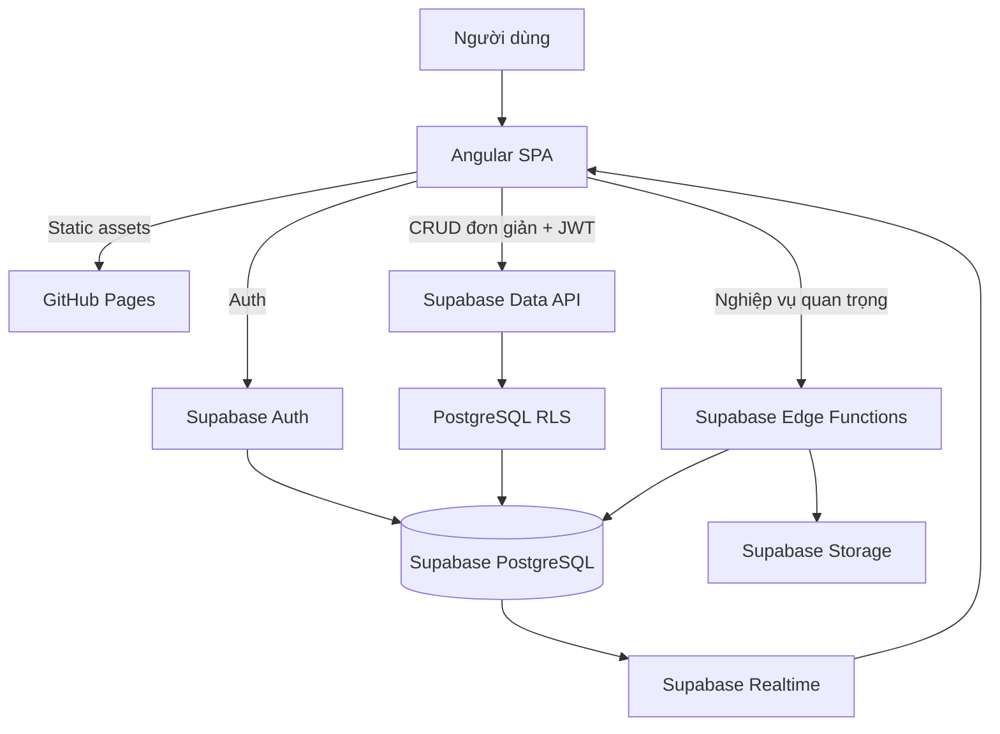

### Angular gọi trực tiếp Supabase khi
- SELECT/list/detail.
- CRUD đơn giản, ít side-effect.
- Quyền mô tả được bằng RLS.

### Bắt buộc Edge Function khi
- sinh học phí;
- ghi payment;
- carry-over;
- payroll;
- close period;
- quỹ/lợi nhuận;
- import Excel;
- thao tác dùng secret;
- nghiệp vụ transaction/idempotency/audit.

## 4.2 Source tree

```text
center-management/
├── src/app/
│   ├── core/
│   │   ├── auth/
│   │   ├── guards/
│   │   ├── supabase/
│   │   └── layout/
│   ├── shared/
│   └── features/
│       ├── dashboard/
│       ├── classes/
│       ├── students/
│       ├── attendance/
│       ├── evaluations/
│       ├── staff/
│       ├── assignments/
│       ├── tuition/
│       ├── finance/
│       ├── payroll/
│       ├── reports/
│       ├── periods/
│       ├── settings/
│       └── audit/
├── supabase/
│   ├── migrations/
│   ├── seed.sql
│   └── functions/
│       ├── _shared/
│       ├── dashboard-summary/
│       ├── generate-month-sessions/
│       ├── attendance-bulk-upsert/
│       ├── generate-tuition/
│       ├── record-payment/
│       ├── calculate-payroll/
│       └── close-period/
└── .github/workflows/
```

## 4.3 Deployment

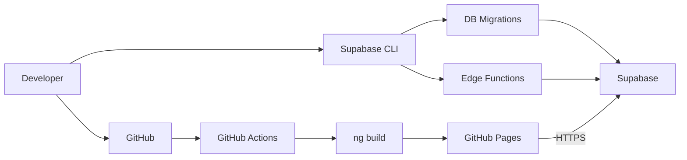

> Angular Router trên static hosting phải xử lý deep-link fallback; project pages cần cấu hình `base href` đúng path repository.

---

# 5. Data Model

## 5.1 Quy ước
- UUID PK.
- `timestamptz` cho thời gian audit.
- VND dùng `bigint`, không dùng float.
- Tỷ lệ dùng `numeric`.
- Không hard delete payment/payroll/transaction.
- Hầu hết entity chứa `center_id`.

## TBL-01 `centers`
`id`, `code`, `name`, `status`, timestamps.

## TBL-02 `profiles`
`user_id` FK `auth.users`, `center_id`, `full_name`, `role`, `staff_id`, `active`.

## TBL-03 `accounting_periods`
`id`, `center_id`, `year`, `month`, `start_date`, `end_date`, `status`, `closed_at`, `closed_by`.

Unique `(center_id, year, month)`.

## TBL-04 `classes`
`id`, `center_id`, `code`, `name`, `grade`, `subject`, `standard_unit_fee`, `collection_method`, `status`, `note`.

## TBL-05 `class_schedules`
`id`, `class_id`, `weekday`, `start_time`, `end_time`, `effective_from`, `effective_to`, `active`.

## TBL-06 `students`
`id`, `center_id`, `code`, `full_name`, `phone`, `parent_name`, `parent_phone`, `status`, `note`.

## TBL-07 `enrollments`
`id`, `student_id`, `class_id`, `enrolled_from`, `enrolled_to`, `status`, `unit_price_override`, `tuition_exempt`, `note`.

> Student có thể học nhiều lớp; không để `class_id` trực tiếp trong `students`.

## TBL-08 `class_sessions`
`id`, `class_id`, `period_id`, `session_date`, `start_time`, `end_time`, `status`, `teacher_id`, `note`.

Thay thế các cột Buổi 1..31.

## TBL-09 `attendance`
`id`, `session_id`, `enrollment_id`, `status`, `note`, `marked_by`, `marked_at`.

Unique `(session_id, enrollment_id)`.

Enum:
- PRESENT = C
- ABSENT = N
- EXCUSED = P

## TBL-10 `student_session_evaluations`
`id`, `session_id`, `enrollment_id`, `homework_score`, `understanding_score`, `attitude_score`, `learning_gap`, `comment`, `created_by`.

## TBL-11 `staff`
`id`, `center_id`, `code`, `full_name`, `staff_type`, `phone`, `primary_subject`, `status`, `note`.

## TBL-12 `class_assignments`
`id`, `class_id`, `staff_id`, `period_id`, `role`, `planned_sessions`, `start_date`, `end_date`.

Role: MAIN_TEACHER / ASSISTANT.

## TBL-13 `tuition_ledgers`
`id`, `period_id`, `enrollment_id`, `attended_sessions`, `absent_sessions`, `billable_sessions`, `unit_price`, `gross_amount`, `opening_debt`, `adjustment_amount`, `amount_due`, `paid_amount`, `debt_amount`, `status`, `generated_at`.

Unique `(period_id, enrollment_id)`.

## TBL-14 `tuition_adjustments`
`id`, `period_id`, `enrollment_id`, `type`, `amount`, `reason`, `source_period_id`, `created_by`.

Type: DISCOUNT / CARRY_IN / CARRY_OUT / OPENING_DEBT / MANUAL.

## TBL-15 `payments`
`id`, `tuition_ledger_id`, `amount`, `paid_at`, `method`, `reference`, `note`, `created_by`, `voided_at`.

## TBL-16 `student_rewards`
`id`, `period_id`, `student_id`, `class_id`, `amount`, `reason`, `note`.

## TBL-17 `financial_transactions`
`id`, `period_id`, `transaction_date`, `type`, `category`, `class_id`, `description`, `amount`, `attachment_path`, `created_by`.

## TBL-18 `payroll_policies`
`id`, `center_id`, `name`, `teacher_percent`, `assistant_percent`, `max_total_percent`, `rounding_step`, `effective_from`, `effective_to`.

Policy mới có thể seed theo hướng **GV 25% + TG 15%, tổng <= 40%**, làm tròn theo bước cấu hình (ví dụ 50.000 đ). Không hard-code.

## TBL-19 `payroll_runs`
`id`, `period_id`, `status`, `total_amount`, `calculated_at`, `approved_at`, `version`.

## TBL-20 `payroll_items`
`id`, `payroll_run_id`, `staff_id`, `class_id`, `role`, `class_revenue`, `sessions_taught`, `applied_percent`, `base_amount`, `bonus`, `penalty`, `final_amount`.

## TBL-21 `fund_ledger`
`id`, `period_id`, `type`, `amount`, `note`.

## TBL-22 `profit_distributions`
`id`, `period_id`, `recipient_name`, `recipient_user_id`, `ratio`, `amount`.

## TBL-23 `system_settings`
`id`, `center_id`, `key`, `value_json`, `updated_by`.

## TBL-24 `audit_logs`
`id`, `center_id`, `actor_user_id`, `action`, `resource_type`, `resource_id`, `before_data`, `after_data`, `trace_id`, `created_at`.

---

# 6. CLASS Diagram

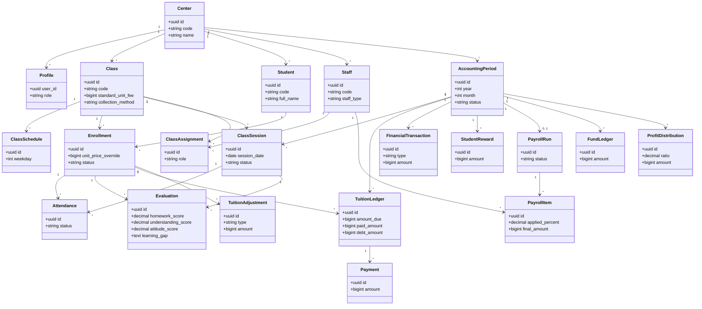

---

# 7. Business Rules

## BR-01 Class code
Unique trong center; slot Excel không phải identity.

## BR-02 Student code
Unique trong center; quan hệ dùng UUID.

## BR-03 Enrollment
Roster được xác định qua enrollment active theo ngày.

## BR-04 Generate sessions
Từ weekly schedule; idempotent; CANCELLED không delete.

## BR-05 Attendance
Chỉ GV/TG được assignment hoặc Admin được ghi; kỳ CLOSED bị khóa.

## BR-06 Evaluation
Mỗi session/student có thể lưu BTVN, hiểu bài, thái độ, lỗ hổng, nhận xét.

## BR-07 Unit price
`unit_price_override ?? class.standard_unit_fee`.

## BR-08 PER_SESSION tuition
```text
gross_amount = billable_sessions × unit_price
amount_due = gross_amount + opening_debt + positive_adjustment - discount
```

## BR-09 PREPAID tuition
Sinh theo số buổi kế hoạch đã chốt; hoàn/giảm tạo adjustment, không sửa lịch sử tùy tiện.

## BR-10 Payment
Payment sai phải void + tạo mới; `paid_amount = SUM(active payment)`, `debt = max(0, due-paid)`.

## BR-11 Carry-over
Có source period/source adjustment; mỗi nguồn carry đúng một lần.

## BR-12 Payroll
Config theo role/class/sĩ số/%/session/bonus/penalty/cap/rounding. Không tính ở Angular.

## BR-13 Fund
```text
profit_before_fund =
  tuition_income + other_income
  - payroll - student_rewards - other_expenses

fund_contribution = max(0, profit_before_fund × fund_percent)
distributable_profit = max(0, profit_before_fund - fund_contribution)
```

## BR-14 Profit distribution
Tổng ratio = 100% trước close.

## BR-15 Close period blockers
- session đã qua nhưng chưa điểm danh (nếu strict);
- ledger chưa confirm;
- roster/ledger mismatch nghiêm trọng;
- payroll chưa approved;
- transaction thiếu metadata;
- ratio lợi nhuận sai.

## BR-16 Audit
Payment, adjustment, payroll, close/reopen, role, settings, finance đều audit.

---

# 8. UC – Use Case

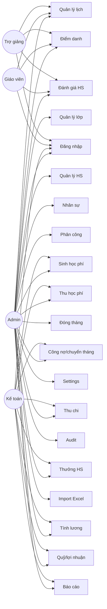

## 8.1 Chi tiết UC chính

### UC-01 Login
1. User nhập credential.
2. Angular gọi Supabase Auth.
3. Nhận session/JWT.
4. Load profile/role.
5. Redirect dashboard.

### UC-02 Manage Class
Admin tạo/sửa class, fee, collection method, schedule, assignment.

### UC-03 Manage Student
Tạo student → enrollment → optional unit price override.

### UC-04 Manage Schedule
Sinh session, đổi buổi, hủy, thêm buổi bù.

### UC-07 Attendance
Chọn class/session → load roster → C/N/P → bulk save → audit.

### UC-08 Evaluation
BTVN + hiểu bài + thái độ + learning gap + comment.

### UC-09 Generate Tuition
Preview → validation → confirm snapshot ledger.

### UC-10 Record Payment
Chọn ledger → amount/method/date → transactional save → recalc debt.

### UC-11 Carry-over
Tạo adjustment có source → carry period sau → chống duplicate.

### UC-14 Payroll
Preview policy → bonus/penalty → cap/round → approve.

### UC-17 Close Period
Integrity check → preview → fix blockers → carry-over → close.

### UC-20 Excel Import
Upload → parse → staging → validation → mapping → commit → reconciliation.

---

# 9. AC – Activity Diagrams

## AC-01 Monthly operation
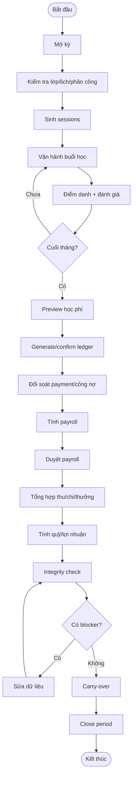

## AC-02 Attendance + Evaluation
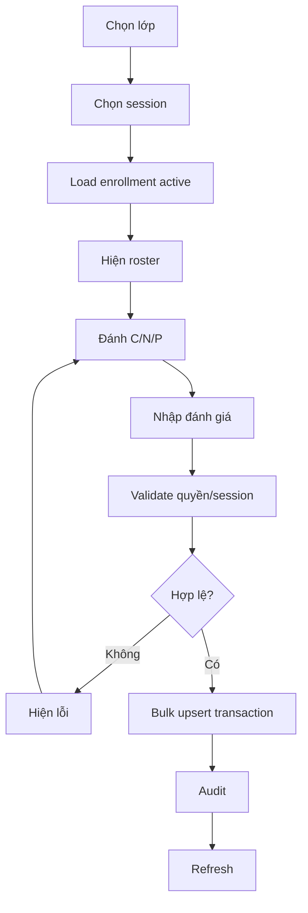

## AC-03 Tuition
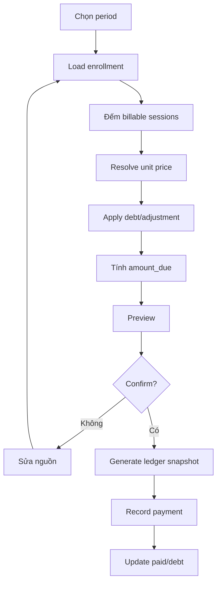

## AC-04 Payroll
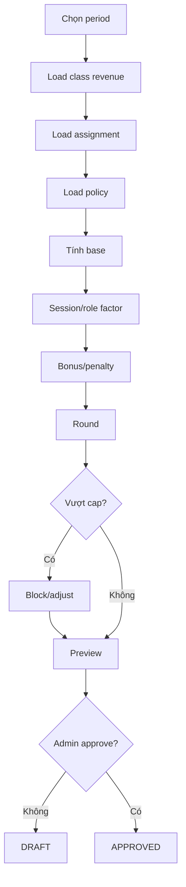

## AC-05 Carry-over
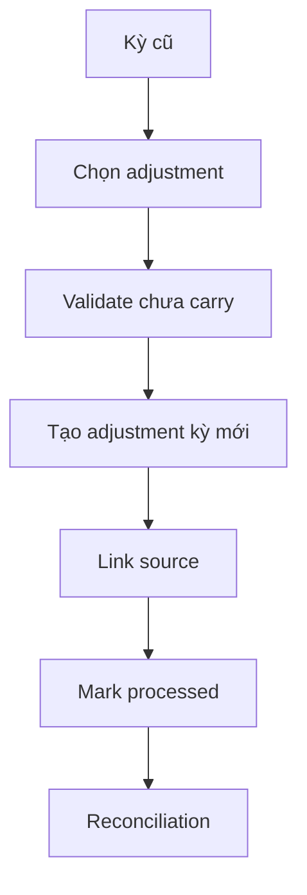

---

# 10. Sequence Diagrams

## SEQ-01 Login
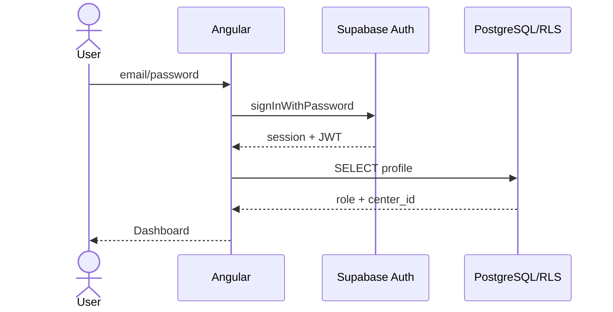

## SEQ-02 Dashboard
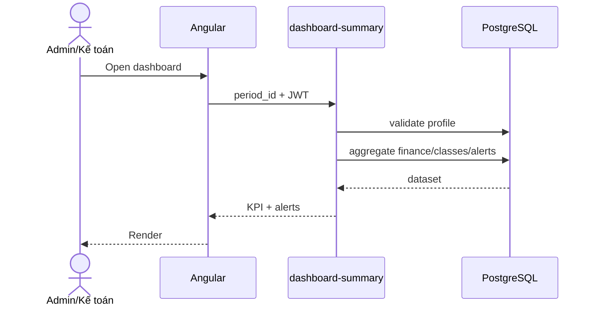

## SEQ-03 Attendance bulk
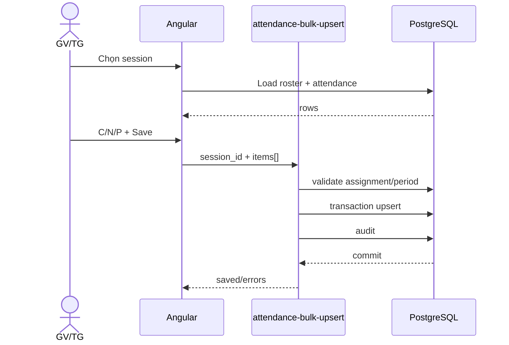

## SEQ-04 Generate Tuition
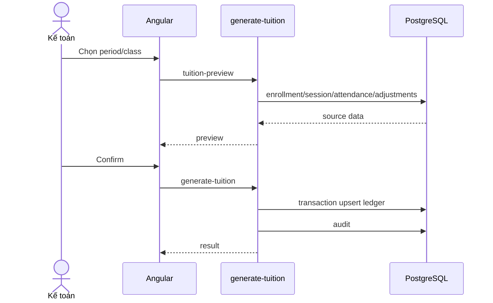

## SEQ-05 Payment
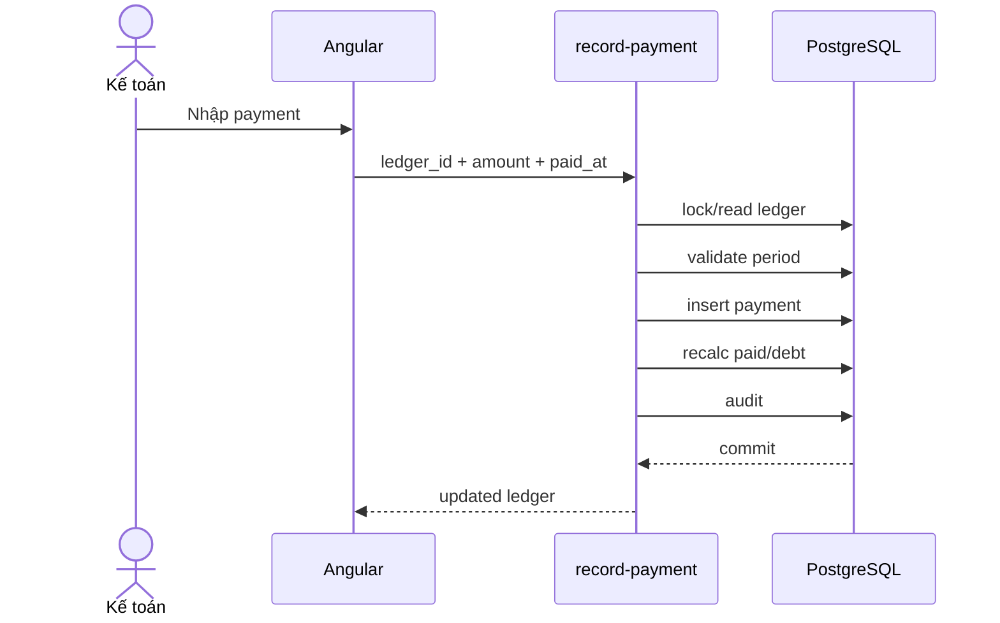

## SEQ-06 Payroll
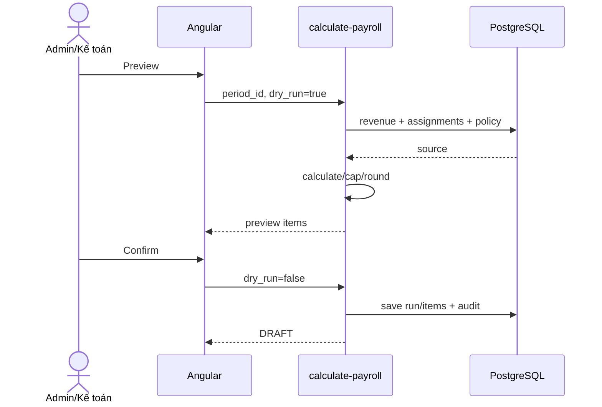

## SEQ-07 Close Period
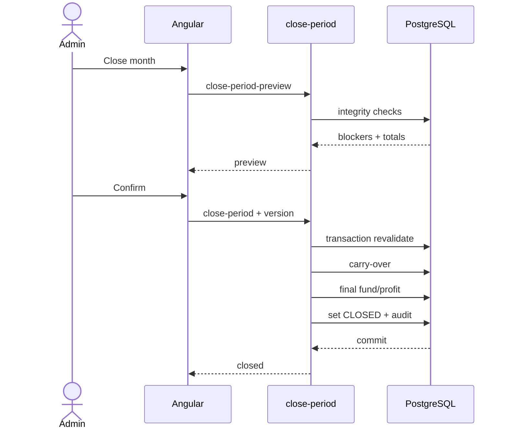

---

# 11. API Design

## 11.1 Conventions
- JWT trong Authorization.
- Role không lấy từ request body.
- Edge Function response có `success`, `data`, `error`, `traceId`.
- Status: 200/201/400/401/403/404/409/422/500.
- Business write quan trọng phải idempotent/transactional.

### Response success
```json
{
  "success": true,
  "data": {},
  "error": null,
  "traceId": "..."
}
```

### Response error
```json
{
  "success": false,
  "data": null,
  "error": {
    "code": "PERIOD_CLOSED",
    "message": "Kỳ kế toán đã đóng",
    "details": {}
  },
  "traceId": "..."
}
```

## 11.2 Supabase Data API

| ID | Table | Operation | Mục đích | Role | Ghi chú |
| --- | --- | --- | --- | --- | --- |
| DA-01 | classes | SELECT | Danh sách/chi tiết lớp | Admin/GV/TG/Kế toán | RLS theo trung tâm |
| DA-02 | class_schedules | SELECT | Lịch tuần của lớp | Admin/GV/TG | RLS theo trung tâm |
| DA-03 | students | SELECT | Danh sách/hồ sơ HS | Admin/GV/TG/Kế toán | Theo lớp được phép xem |
| DA-04 | enrollments | SELECT | Roster theo lớp | Admin/GV/TG/Kế toán | Không xóa vật lý lịch sử |
| DA-05 | class_sessions | SELECT | Danh sách buổi học | Admin/GV/TG | Theo assignment/lớp |
| DA-06 | attendance | SELECT | Đọc điểm danh | Admin/GV/TG | Ghi bulk qua EF |
| DA-07 | student_session_evaluations | SELECT/UPSERT | Đánh giá học tập | Admin/GV/TG | Chỉ lớp được phân công |
| DA-08 | staff | SELECT | Danh sách nhân sự | Admin | Thông tin nhạy cảm giới hạn |
| DA-09 | class_assignments | SELECT | Phân công lớp | Admin/GV/TG | GV/TG chỉ thấy assignment của mình |
| DA-10 | tuition_ledgers | SELECT | Sổ học phí | Admin/Kế toán | Không sửa trực tiếp |
| DA-11 | payments | SELECT | Lịch sử thanh toán | Admin/Kế toán | Insert qua EF record-payment |
| DA-12 | financial_transactions | SELECT | Thu chi khác | Admin/Kế toán | Write có audit |
| DA-13 | payroll_items | SELECT | Chi tiết lương | Admin/Kế toán | Có thể mở quyền staff xem lương mình |
| DA-14 | audit_logs | SELECT | Audit | Admin | Không update/delete |

## 11.3 Edge Functions

| ID | Method | Path | Role | Request | Kết quả |
| --- | --- | --- | --- | --- | --- |
| EF-01 | POST | /functions/v1/dashboard-summary | Admin/Kế toán | {period_id} | KPI tổng quan, cảnh báo dữ liệu |
| EF-02 | POST | /functions/v1/generate-month-sessions | Admin | {class_id, period_id} | Sinh class_sessions theo lịch tuần, idempotent |
| EF-03 | POST | /functions/v1/attendance-bulk-upsert | GV/TG/Admin | {session_id, items[]} | Validate assignment; upsert C/N/P; audit |
| EF-04 | POST | /functions/v1/evaluation-bulk-upsert | GV/TG/Admin | {session_id, items[]} | Lưu BTVN/hiểu bài/thái độ/nhận xét |
| EF-05 | POST | /functions/v1/tuition-preview | Admin/Kế toán | {period_id, class_id?} | Tính thử phải thu chưa ghi sổ |
| EF-06 | POST | /functions/v1/generate-tuition | Admin/Kế toán | {period_id, class_id?} | Khóa snapshot số buổi/đơn giá/điều chỉnh và sinh ledger |
| EF-07 | POST | /functions/v1/record-payment | Admin/Kế toán | {ledger_id, amount, paid_at, method} | Tạo payment; cập nhật paid/debt trong transaction |
| EF-08 | POST | /functions/v1/create-tuition-adjustment | Admin/Kế toán | {student_id, period_id, type, amount, reason} | Giảm trừ/nợ đầu kỳ/carry-over có audit |
| EF-09 | POST | /functions/v1/carry-over-period | Admin/Kế toán | {from_period_id,to_period_id} | Chuyển nợ/giảm trừ hợp lệ sang tháng sau |
| EF-10 | POST | /functions/v1/calculate-payroll | Admin/Kế toán | {period_id, dry_run} | Tính lương GV/TG theo policy; cap; rounding |
| EF-11 | POST | /functions/v1/approve-payroll | Admin | {payroll_run_id} | Khóa payroll run và items; audit |
| EF-12 | POST | /functions/v1/close-period-preview | Admin/Kế toán | {period_id} | Tổng thu/chi/lương/thưởng/quỹ/lợi nhuận + blockers |
| EF-13 | POST | /functions/v1/close-period | Admin | {period_id, expected_version} | Kiểm tra blocker, carry-over, khóa kỳ, audit |
| EF-14 | POST | /functions/v1/data-integrity-check | Admin | {period_id} | Roster/ledger mismatch, thiếu điểm danh, giao dịch lỗi |
| EF-15 | POST | /functions/v1/import-center-workbook | Admin | {import_job_id, mode} | Import sau preview/validation; idempotent |

## 11.4 EF-03 Attendance detail

Request:
```json
{
  "session_id": "uuid",
  "items": [
    {
      "enrollment_id": "uuid",
      "status": "PRESENT",
      "note": null
    }
  ]
}
```

Validation:
1. JWT.
2. Session tồn tại.
3. Period chưa CLOSED.
4. Actor được assignment.
5. Enrollment thuộc class và active tại session_date.
6. Status hợp lệ.

## 11.5 EF-06 Generate Tuition detail

Request:
```json
{
  "period_id": "uuid",
  "class_id": "uuid",
  "mode": "CONFIRM"
}
```

Logic: lock period → enrollment → collection policy → attendance/session → unit price → debt/adjustment → calculate → snapshot ledger → audit.

## 11.6 EF-07 Record Payment detail

Request:
```json
{
  "ledger_id": "uuid",
  "amount": 300000,
  "paid_at": "2026-09-04T09:00:00+07:00",
  "method": "BANK_TRANSFER",
  "reference": "QR-...",
  "note": ""
}
```

Transaction:
```text
BEGIN
  validate ledger + period
  insert payment
  sum active payments
  update ledger paid_amount/debt/status
  insert audit
COMMIT
```

## 11.7 EF-10 Payroll detail

Request:
```json
{
  "period_id": "uuid",
  "dry_run": true
}
```

Response item:
```json
{
  "staff_id": "uuid",
  "class_id": "uuid",
  "role": "TEACHER",
  "class_revenue": 5025000,
  "applied_percent": 0.25,
  "base_amount": 1256250,
  "rounded_amount": 1250000,
  "bonus": 0,
  "penalty": 0,
  "final_amount": 1250000
}
```

## 11.8 Idempotency
Bắt buộc cho:
- generate-month-sessions;
- generate-tuition;
- carry-over-period;
- calculate-payroll save;
- close-period;
- import-center-workbook.

Dùng unique constraint + request/business key + upsert + version.

---

# 12. Màn hình

| ID | Route | Màn hình | Role | Chức năng | Data/API |
| --- | --- | --- | --- | --- | --- |
| SCR-01 | /login | Đăng nhập | Tất cả | Email/mật khẩu; quên mật khẩu | Supabase Auth |
| SCR-02 | /dashboard | Dashboard | Admin/Kế toán | KPI thu, nợ, lương, lợi nhuận, sĩ số, cảnh báo | EF dashboard-summary |
| SCR-03 | /classes | Danh sách lớp | Admin/GV/TG | Tìm kiếm, lọc khối/môn/trạng thái | classes |
| SCR-04 | /classes/new | Tạo lớp | Admin | Mã lớp, tên, khối, môn, học phí, cách thu, lịch tuần | classes + schedules |
| SCR-05 | /classes/:id | Chi tiết lớp | Admin/GV/TG/Kế toán | Thông tin, roster, lịch, doanh thu, nhân sự | class detail queries |
| SCR-06 | /classes/:id/schedule | Lịch lớp | Admin/GV | Lịch tuần, sinh buổi học tháng, hủy/đổi buổi | EF generate-month-sessions |
| SCR-07 | /students | Danh sách học sinh | Admin/GV/TG/Kế toán | Tìm kiếm, lớp, trạng thái, công nợ | students + enrollments |
| SCR-08 | /students/new | Thêm học sinh | Admin | Thông tin cơ bản, xếp lớp, đơn giá riêng | students + enrollments |
| SCR-09 | /students/:id | Hồ sơ học sinh | Admin/GV/TG/Kế toán | Lớp, điểm danh, học phí, đánh giá, lịch sử | student aggregate |
| SCR-10 | /attendance | Chọn buổi điểm danh | GV/TG/Admin | Lớp, ngày, trạng thái buổi | class_sessions |
| SCR-11 | /attendance/:sessionId | Điểm danh buổi học | GV/TG/Admin | Bulk C/N/P, nhận xét nhanh | EF attendance-bulk-upsert |
| SCR-12 | /evaluations/:sessionId | Đánh giá buổi học | GV/TG/Admin | BTVN, hiểu bài, thái độ, nhận xét, lỗ hổng | evaluations |
| SCR-13 | /staff | Danh sách nhân sự | Admin | GV/TG, môn, trạng thái, liên hệ | staff |
| SCR-14 | /staff/:id | Chi tiết nhân sự | Admin | Phân công, số buổi, lịch sử lương | staff aggregate |
| SCR-15 | /assignments | Phân công giảng dạy | Admin | GV/TG theo lớp và kỳ | class_assignments |
| SCR-16 | /finance/tuition | Tổng quan học phí | Admin/Kế toán | Phải thu, đã thu, nợ theo lớp | EF tuition-summary |
| SCR-17 | /finance/tuition/:classId | Học phí lớp | Admin/Kế toán | Ledger từng HS, điều chỉnh, carry-over | tuition_ledgers |
| SCR-18 | /finance/payments/new | Ghi nhận thu học phí | Admin/Kế toán | Số tiền, ngày thu, phương thức, ghi chú | EF record-payment |
| SCR-19 | /finance/debts | Công nợ | Admin/Kế toán | Nợ đầu kỳ, nợ hiện tại, giảm chuyển tháng | ledger + adjustments |
| SCR-20 | /finance/transactions | Thu/chi khác | Admin/Kế toán | Thu/chi, nhóm, lớp, nội dung, chứng từ | financial_transactions |
| SCR-21 | /finance/rewards | Thưởng học sinh | Admin/Kế toán | HS, số tiền, lý do | student_rewards |
| SCR-22 | /payroll | Lương nhân sự | Admin/Kế toán | Preview, tính, thưởng/phạt, duyệt | EF calculate-payroll |
| SCR-23 | /finance/fund-profit | Quỹ & chia lợi nhuận | Admin | Trích quỹ, quỹ đầu/cuối kỳ, người nhận | EF close-period-preview |
| SCR-24 | /reports/classes | Báo cáo theo lớp | Admin/Kế toán | Sĩ số, thu, nợ, lương, lợi nhuận | reporting views |
| SCR-25 | /reports/students | Báo cáo học tập HS | Admin/GV/TG | Chuyên cần, BTVN, hiểu bài, thái độ, lỗ hổng | evaluation views |
| SCR-26 | /periods | Quản lý tháng | Admin/Kế toán | Mở tháng, khóa tháng, chuyển số dư | EF open/close-period |
| SCR-27 | /settings | Thiết lập hệ thống | Admin | Quỹ, cách tính lương, danh mục, phân quyền | system_settings |
| SCR-28 | /audit | Nhật ký hệ thống | Admin | Ai sửa gì, trước/sau, traceId | audit_logs |
| SCR-29 | /migration | Nhập dữ liệu Excel | Admin | Preview dữ liệu, lỗi, map, import | EF import-center-workbook |

---

# 13. Navigation

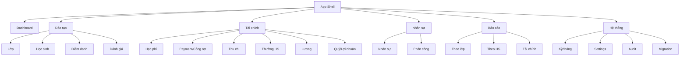

---

# 14. Dashboard

## KPI
- period;
- active students/classes;
- phải thu/đã thu/nợ/tỷ lệ thu;
- payroll;
- other income/expense;
- rewards;
- profit before fund;
- fund contribution;
- distributable profit.

## Alert
- session thiếu điểm danh;
- active enrollment chưa có ledger;
- roster/ledger mismatch;
- transaction thiếu metadata;
- payroll chưa approve;
- adjustment chưa carry.

---

# 15. Security & RLS

1. Bật RLS cho tất cả bảng exposed.
2. `anon` không đọc dữ liệu nghiệp vụ.
3. `authenticated` chỉ grant operation thật sự cần.
4. Secret/server credential chỉ ở Edge Function.
5. Angular/GitHub Pages chỉ dùng client/publishable credential.
6. Finance writes qua Edge Function.
7. CORS chỉ allow origin production/dev cấu hình.
8. `profiles.role` không cho user tự sửa.

Pseudo policy:
```sql
create policy "read own center classes"
on public.classes
for select
to authenticated
using (center_id = current_center_id());
```

---

# 16. Transaction & consistency

Phải transaction:
- record payment;
- generate tuition;
- payroll save/approve;
- close period;
- Excel import.

Optimistic version cho:
- period;
- payroll run;
- financial snapshot quan trọng.

---

# 17. Audit & Logs

Audit:
```json
{
  "actor": "user-uuid",
  "action": "PAYMENT_CREATED",
  "resource_type": "payment",
  "resource_id": "uuid",
  "after": {"amount": 300000},
  "trace_id": "..."
}
```

Edge Function log:
- traceId;
- function;
- actor;
- center;
- duration;
- result/errorCode.

Không log password/JWT/secret.

---

# 18. Migration Excel → Supabase

## 18.1 Trình tự
1. Center + period.
2. Classes + schedules.
3. Staff + assignments.
4. Students + enrollments.
5. Sessions + attendance.
6. Tuition ledgers + adjustments + payment state.
7. Thu/chi + rewards.
8. Payroll snapshot.
9. Reconciliation.

## 18.2 Nguyên tắc
- Không import mỗi sheet thành table.
- `#REF!` là validation error, không phải dữ liệu.
- Dòng finance thiếu metadata → `MIGRATION_REVIEW_REQUIRED`.
- Snapshot payroll cũ không trở thành policy tương lai.

## 18.3 Reconciliation target

| Chỉ số | Workbook |
|---|---:|
| Tổng phải thu | 14.485.000 đ |
| Đã thu | 14.485.000 đ |
| Nợ | 0 đ |
| Payroll | 5.794.000 đ |
| Chi khác | 6.270.898 đ |
| Lợi nhuận trước quỹ | 2.420.102 đ |
| Trích quỹ 10% | ~242.010 đ |
| Lợi nhuận chia | ~2.178.092 đ |

---

# 19. Kế hoạch MVP do deadline gấp

## MVP-0 Foundation
Angular shell + Supabase project + Auth + profiles/RLS + migrations + layout.

## MVP-1 Education core
Login → Dashboard → Classes → Students → Enrollments → Sessions → Attendance → Evaluations.

## MVP-2 Finance
Tuition summary → ledger → payment → debt/adjustment → thu/chi.

## MVP-3 HR/Payroll
Staff → assignments → payroll.

## MVP-4 Period closing
Fund/profit → integrity → carry-over → close → reports.

## MVP-5 Migration
Excel import + reconciliation.

### Nguyên tắc tốc độ
- Simple CRUD: Data API.
- Business action: Edge Function.
- Không FastAPI trong MVP.
- Không microservice.
- Không Redis nếu chưa cần.
- Không generic repository nặng.
- Chưa làm parent portal.

---

# 20. Acceptance Criteria

## Auth
User chưa login không đọc dữ liệu; role đúng.

## Class/Session
Tạo lớp/lịch; generate session không trùng.

## Student
Một HS có thể enroll nhiều lớp; nghỉ/chuyển lớp không mất lịch sử.

## Attendance
Bulk save; C/N/P đúng; GV/TG không sửa lớp khác.

## Tuition
Override unit price; PER_SESSION/PREPAID; ledger snapshot ổn định.

## Payment
Transactional debt update; void có audit.

## Payroll
Policy configurable; cap; rounding; approved snapshot không sửa tự do.

## Close Period
Block invalid data; CLOSED khóa write; carry-over không trùng.

## Migration
Import dữ liệu active; báo mismatch L09; reject `#REF!`; reconcile KPI.

---

# 21. Phụ lục A – Roster trích xuất

| Lớp | Mã HS | Họ tên | Có mặt | Nghỉ | Chưa ĐD | Có trong KT | Phải thu | Đã thu | Có nhận xét |
| --- | --- | --- | --- | --- | --- | --- | --- | --- | --- |
| L06 | HS06-001 | Đào Thị Kim Ngân | 5 | 2 | 2 | Có | 250.000 đ | 250.000 đ | - |
| L06 | HS06-002 | Đặng Phương Anh | 6 | 1 | 2 | Có | 300.000 đ | 300.000 đ | - |
| L06 | HS06-003 | Nguyễn Gia Bảo | 6 | 1 | 2 | Có | 300.000 đ | 300.000 đ | - |
| L06 | HS06-004 | Nguyễn Đặng Gia Bảo | 7 | 0 | 2 | Có | 175.000 đ | 175.000 đ | - |
| L06 | HS06-005 | Tuệ Lâm | 5 | 2 | 2 | Có | 250.000 đ | 250.000 đ | - |
| L06 | HS06-006 | Đặng Khánh Linh | 6 | 1 | 2 | Có | 300.000 đ | 300.000 đ | - |
| L06 | HS06-007 | Nguyễn Ngọc Diệp | 7 | 0 | 2 | Có | 350.000 đ | 350.000 đ | - |
| L06 | HS06-008 | Nguyễn Ngọc Cẩm Tú | 5 | 2 | 2 | Có | 250.000 đ | 250.000 đ | - |
| L06 | HS06-009 | Đào Thế Hoàng | 6 | 1 | 2 | Có | 300.000 đ | 300.000 đ | - |
| L06 | HS06-010 | Đào Nguyễn Bình An | 7 | 0 | 2 | Có | 350.000 đ | 350.000 đ | - |
| L06 | HS06-011 | Nguyễn Trà My | 6 | 1 | 2 | Có | 300.000 đ | 300.000 đ | - |
| L06 | HS06-012 | Bảo Dũng | 6 | 1 | 2 | Có | 300.000 đ | 300.000 đ | - |
| L06 | HS06-013 | Đào Quang Minh | 5 | 2 | 2 | Có | 250.000 đ | 250.000 đ | - |
| L06 | HS06-014 | Duy | 5 | 2 | 2 | Có | 250.000 đ | 250.000 đ | - |
| L06 | HS06-015 | Phúc | 7 | 0 | 2 | Có | 350.000 đ | 350.000 đ | - |
| L06 | HS06-016 | Linh | 4 | 3 | 2 | Có | 200.000 đ | 200.000 đ | - |
| L06 | HS06-017 | Hân | 6 | 0 | 3 | Có | 300.000 đ | 300.000 đ | - |
| L06 | HS06-018 | Kiều Anh | 5 | 1 | 3 | Có | 250.000 đ | 250.000 đ | - |
| L07 | HS07-001 | Lê Ngọc Ánh | 5 | 0 | 3 | Có | 250.000 đ | 250.000 đ | Có |
| L07 | HS07-002 | Nguyễn Thị Hồng Hạnh | 5 | 0 | 3 | Có | 250.000 đ | 250.000 đ | Có |
| L07 | HS07-003 | Nguyễn Văn Phúc | 5 | 0 | 3 | Có | 250.000 đ | 250.000 đ | Có |
| L07 | HS07-004 | Đào Thành Lê | 5 | 0 | 3 | Có | 250.000 đ | 250.000 đ | Có |
| L07 | HS07-005 | Nguyễn Thành Công | 3 | 0 | 5 | Có | 150.000 đ | 150.000 đ | - |
| L07 | HS07-006 | Bùi Bảo Minh Anh | 4 | 1 | 3 | Có | 200.000 đ | 200.000 đ | Có |
| L07 | HS07-007 | Cao Nhật Minh | 5 | 0 | 3 | Có | 250.000 đ | 250.000 đ | Có |
| L07 | HS07-008 | Phạm Mạnh Hùng | 5 | 0 | 3 | Có | 250.000 đ | 250.000 đ | Có |
| L07 | HS07-009 | Hiếu | 2 | 3 | 3 | Có | 100.000 đ | 100.000 đ | Có |
| L07 | HS07-010 | Cẩm Tiên | 5 | 0 | 3 | Có | 250.000 đ | 250.000 đ | Có |
| L07 | HS07-011 | Bảo An | 5 | 0 | 3 | Có | 250.000 đ | 250.000 đ | Có |
| L07 | HS07-012 | Đăng | 2 | 0 | 6 | Có | 100.000 đ | 100.000 đ | Có |
| L07 | HS07-013 | Lan | 1 | 0 | 7 | Có | 50.000 đ | 50.000 đ | Có |
| L08 | HS08-001 | Minh Thư | 7 | 0 | 2 | Có | 350.000 đ | 350.000 đ | - |
| L08 | HS08-002 | Nguyễn Đình Phát | 7 | 0 | 2 | Có | 175.000 đ | 175.000 đ | - |
| L08 | HS08-003 | Đỗ Thị Mai Ngọc | 7 | 0 | 2 | Có | 350.000 đ | 350.000 đ | - |
| L08 | HS08-004 | Bùi Hiền Nhi | 7 | 0 | 2 | Có | 350.000 đ | 350.000 đ | - |
| L08 | HS08-005 | Nguyễn Đặng Gia Hân | 7 | 0 | 2 | Có | 175.000 đ | 175.000 đ | - |
| L08 | HS08-006 | Đào Ngọc Khánh | 6 | 1 | 2 | Có | 300.000 đ | 300.000 đ | - |
| L08 | HS08-007 | Nhân | 6 | 1 | 2 | Có | 300.000 đ | 300.000 đ | - |
| L09 | HS09-001 | Trường An | 5 | 0 | 4 | Có | 540.000 đ | 540.000 đ | Có |
| L09 | HS09-002 | Như Quỳnh | 2 | 3 | 4 | Có | 540.000 đ | 540.000 đ | Có |
| L09 | HS09-003 | Huy Đức | 4 | 1 | 4 | Có | 660.000 đ | 660.000 đ | Có |
| L09 | HS09-004 | Anh Trọng | 5 | 0 | 4 | Có | 480.000 đ | 480.000 đ | Có |
| L09 | HS09-005 | Nguyễn Gia Bảo | 5 | 0 | 4 | Có | 540.000 đ | 540.000 đ | Có |
| L09 | HS09-006 | Phạm Đức Hùng | 5 | 0 | 4 | Có | 540.000 đ | 540.000 đ | Có |
| L09 | HS09-007 | Quân | 5 | 0 | 4 | Có | 480.000 đ | 480.000 đ | Có |
| L09 | HS09-008 | Châu | 0 | 4 | 5 | Có | 0 đ | 0 đ | Có |
| L09 | HS09-009 | Phương Nhi | 5 | 0 | 4 | Có | 540.000 đ | 540.000 đ | Có |
| L09 | HS09-010 | Lê Bảo Châm | 5 | 0 | 4 | Có | 540.000 đ | 540.000 đ | Có |
| L09 | HS09-011 | Tuấn | 0 | 4 | 5 | Không | - | - | Có |
| L09 | HS09-012 | Xuân Quỳnh | 1 | 1 | 7 | Không | - | - | - |

---

# 22. Phụ lục B – Chuyên cần snapshot

| Lớp | Roster | Có mặt | Nghỉ | Chưa điểm danh |
|---|---:|---:|---:|---:|
| L06 | 18 | 104 | 20 | 38 |
| L07 | 13 | 52 | 4 | 48 |
| L08 | 7 | 47 | 2 | 14 |
| L09 | 12 | 42 | 13 | 53 |

> Đây là snapshot workbook; không coi là dữ liệu chuẩn cuối cùng nếu nguồn còn thiếu buổi.

---

# 23. Naming Convention

- DB: snake_case, plural table.
- Angular route: kebab-case.
- Edge Function: kebab-case.
- Giữ business code Excel: L06..., HS06-001..., GV001/TG001....
- Internal FK dùng UUID.

---

# 24. Technical References

- Angular Deployment: https://angular.dev/tools/cli/deployment
- Supabase Edge Functions: https://supabase.com/docs/guides/functions
- Supabase Row Level Security: https://supabase.com/docs/guides/database/postgres/row-level-security
- Supabase API Security: https://supabase.com/docs/guides/api/securing-your-api

---

# 25. Kiến trúc chốt

```text
GitHub Pages
    │
    ▼
Angular SPA
    │
    ├── Supabase Auth
    ├── Supabase Data API + RLS
    ├── Supabase Realtime (nếu cần)
    │
    └── Supabase Edge Functions
              │
              ▼
        PostgreSQL
```

**Thứ tự code đề xuất:** Auth → Class/Student → Session/Attendance/Evaluation → Tuition/Payment → Staff/Payroll → Period Closing/Reports → Excel Migration.

Điểm quan trọng nhất: **không mang cấu trúc Excel 1:1 sang database**. Excel chỉ là nguồn migration ban đầu; hệ thống mới dùng mô hình dữ liệu chuẩn hóa và khóa nghiệp vụ tài chính qua Edge Functions + RLS.
